# Проєкт на мові Python
## Початковий образ в Docker
Код докер файлу:
```
FROM python:slim-bullseye

EXPOSE 8080

# Set the working directory to /app
WORKDIR /app

# Copy the current directory contents into the container at /app
COPY . /app

# Create a vaairtual environment and install dependencies
RUN python -m venv ./.venv 

RUN . ./.venv/bin/activate

RUN pip install -r requirements/backend.in

# Run the application when the container launches
CMD ["uvicorn", "spaceship.main:app", "--host=0.0.0.0", "--port=8080"]
```
[Посилання на коміт](https://github.com/MrSampy/Software-development-methodologies/commit/77a17244822f45cfdfb1bc4f19df6316bd942a9f)</br></br>
Команда для збірки образу:
```
docker build -t python-1.0-test .
```
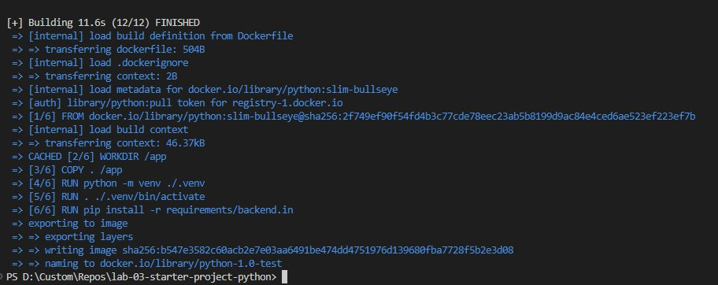
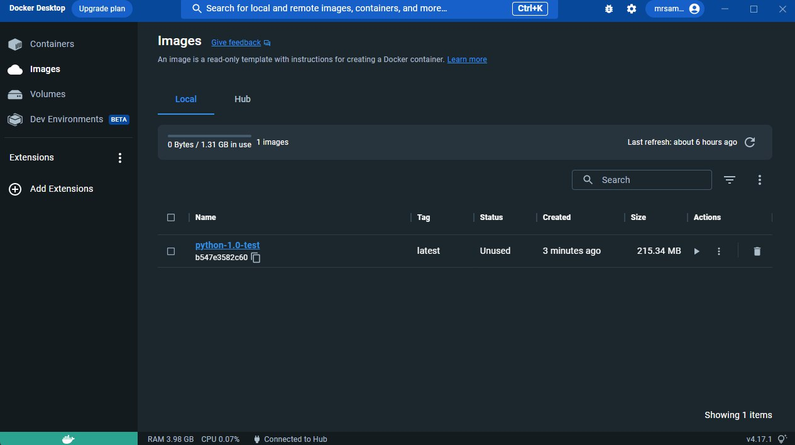
Команда для запуску образу:
```
docker run -p 8080:8080 --rm python-1.0-test
```
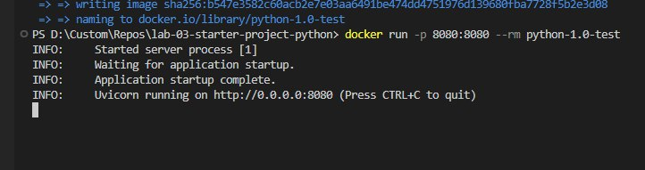
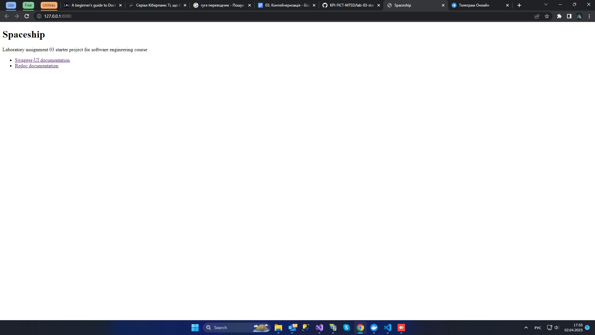

<b>Розмір: 215.34 М </br>
Час: 11.6 s</b></br>

## Зміни в api.py
Код api.py:
```
from fastapi import APIRouter

router = APIRouter()


@router.get('')
def get_userinfo() -> dict:
    data = {
        "name": "Serhiy",
        "second_name": "kolosov",
        "age": 19,
        "telegram": "MrSampy",
        "Job": "InCore",
    }

    return data
```
[Посилання на коміт](https://github.com/MrSampy/Software-development-methodologies/commit/2709af92a1944b42adcde49a38d18143704f6ddc)</br>
Команда для збірки образу:
```
docker build -t python-2.0-test .
```
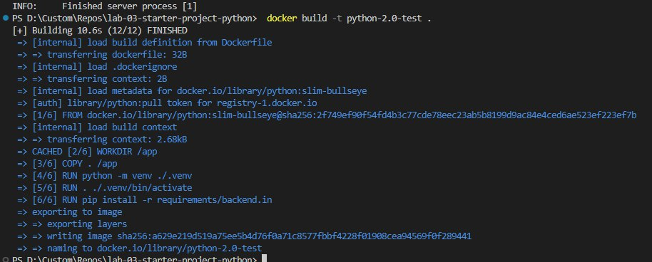
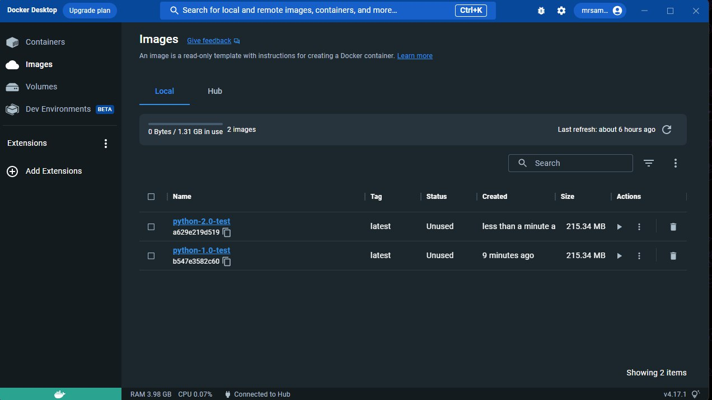

Команда для запуску образу:
```
docker run -p 8080:8080 --rm python-2.0-test
```
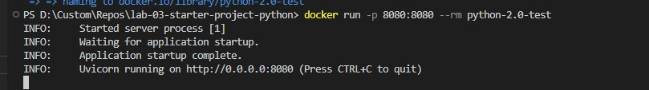
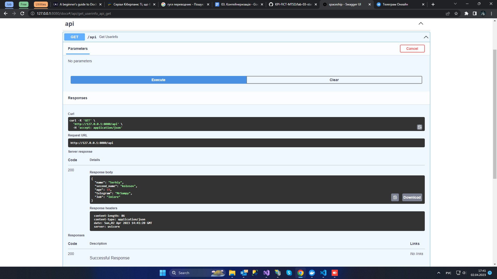
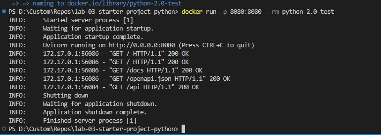

<b>Розмір: 215.34 М </br>
Час: 10.6 s(Більша швидкіть через те, що python:slim-bullseye був вже завантажений, і докер взяв його з кешу)</b></br>

## Оптимізація докер файлу

Код докер файлу:

```
#Set the base image to the official Python Alpine image
FROM python:slim-bullseye

#Expose port 8080 to the outside world
EXPOSE 8080

#Set the working directory inside the container to /app
WORKDIR /app

#Copy the requirements file into the container
COPY requirements/backend.in .

#Install the required Python packages listed in backend.in
RUN pip install --no-cache-dir -r backend.in

#Copy the entire contents of the current directory into the container
COPY . .

#Specify the command to run when the container starts up
CMD ["uvicorn", "spaceship.main:app", "--host=0.0.0.0", "--port=8080"]
```
[Посилання на коміт](https://github.com/MrSampy/Software-development-methodologies/commit/421f80e3c4dc867c279cc5babc8c6d5ef48a8cf7)</br>

<h4 id="solution">У цьому випадку спочатку створюється копія файлу з залежностями Python, незалежно від іншого вмісту директорії. Залежності встановлюються після цього. Таким чином, Docker створить кеш-шар з залежностями, які будуть використовуватися з кешу у наступних збірках, якщо залежності не змінюватимуться. </h4>

Код api.py:

```
from fastapi import APIRouter

router = APIRouter()


@router.get('')
def get_userinfo() -> dict:
    data = {
        "name": "Serhiy",
        "second_name": "kolosov",
        "age": 19,
        "telegram": "MrSampy",
        "job": "InCore",
        "languages": ["C#", "C++", "Golang", "JS"],
        "phoneNumber":"+380989842116"
    }
    return data
```
[Посилання на коміт](https://github.com/MrSampy/Software-development-methodologies/commit/3a336653ab9a389a3e303149a5eea1ffc9d18485)</br>

Команда для збірки образу:
```
docker build -t python-3.0-test .
```
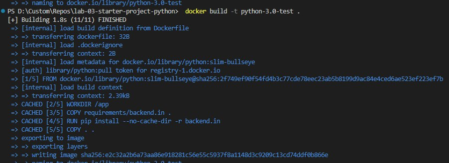
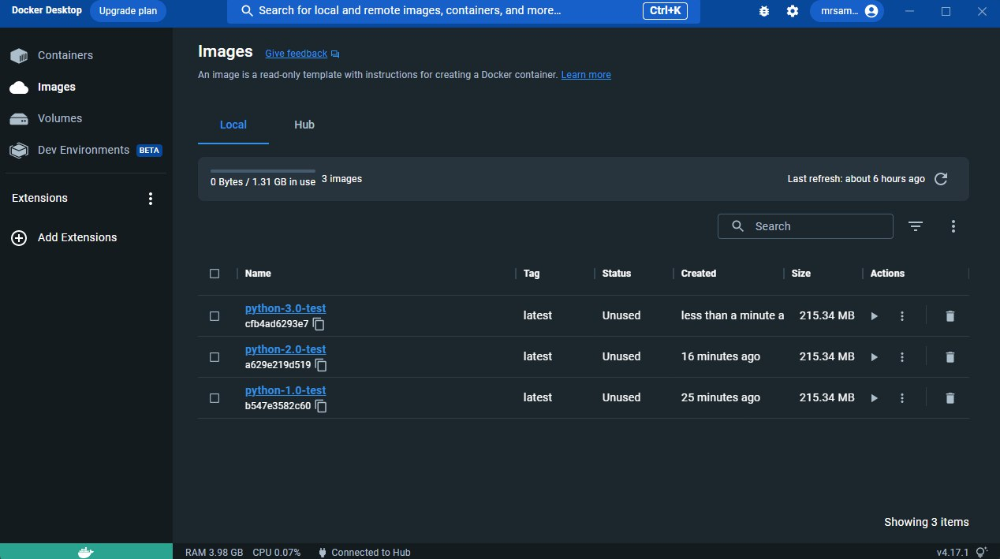
Команда для запуску образу:
```
docker run -p 8080:8080 --rm python-3.0-test
```
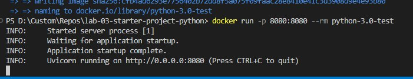
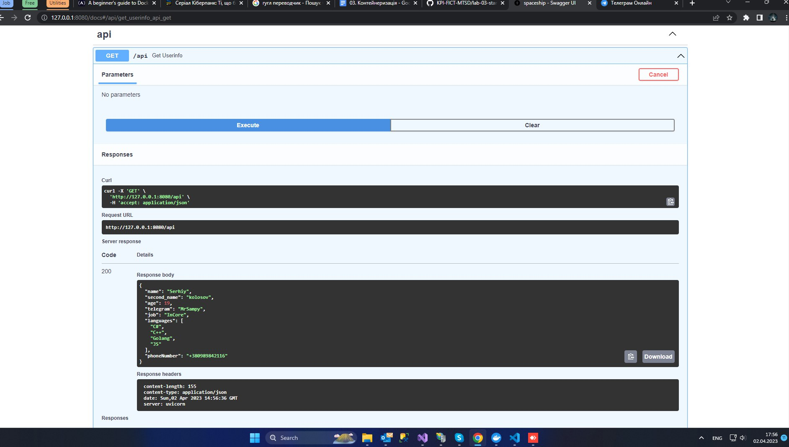

<b>Розмір: 215.34 М </br>
Час: 1.8 s(Більша швидкіть через <a href=#solution>цю причину.</a>)</b></br>

## Зміна базового образу

Код докер файлу:

```
#Set the base image to the official Python Alpine image
FROM python:alpine

#Expose port 8080 to the outside world
EXPOSE 8080

#Set the working directory inside the container to /app
WORKDIR /app

#Copy the requirements file into the container
COPY requirements/backend.in .

#Install the required Python packages listed in backend.in
RUN pip install --no-cache-dir -r backend.in

#Copy the entire contents of the current directory into the container
COPY . .

#Specify the command to run when the container starts up
CMD ["uvicorn", "spaceship.main:app", "--host=0.0.0.0", "--port=8080"]
```
[Посилання на коміт](https://github.com/MrSampy/Software-development-methodologies/commit/e75675f77f710c5b2965eddfbf26249d9dec2a6b)</br>

Команда для збірки образу:
```
docker build -t python-4.0-test .
```
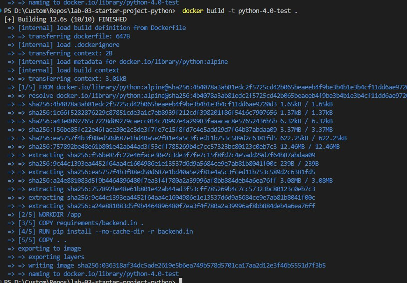
Команда для запуску образу:
```
docker run -p 8080:8080 --rm python-4.0-test
```


<b>Розмір: 111.76 М(Розмір зменшився тому, що новий базовий образ менше важить) </br>
Час: 12.6 s(Швидкість зменшилися через те, що тре було час, щоб вперше завантажити новий базовий образ)</b></br>

##Порівнння базових образів

Код backend.in:
```
pydantic
starlette
uvicorn[standard]
numpy==1.24.2
```
[Посилання на коміт](https://github.com/MrSampy/Software-development-methodologies/commit/66086d91d8520bcd1b2a18e630124fce83c3bc1c)</br>

Код api.py:

```
import numpy as np
from fastapi import APIRouter

router = APIRouter()


@router.get('')
def get_userinfo() -> dict:
    data = {
        "name": "Serhiy",
        "second_name": "kolosov",
        "age": 19,
        "telegram": "MrSampy",
        "job": "InCore",
        "languages": ["C#", "C++", "Golang", "JS"],
        "phoneNumber":"+380989842116"
    }
    return data

@router.get('/multiply')
def multiply() -> dict:
    first_matrix = np.random.rand(10, 10)
    second_matrix = np.random.rand(10, 10)

    result = np.dot(first_matrix, second_matrix)

    result = {
        "first_matrix": first_matrix.tolist(),
        "second_matrix": second_matrix.tolist(),
        "result": result.tolist()
    }

    return result
```
[Посилання на коміт](https://github.com/MrSampy/Software-development-methodologies/commit/81df347e2f3fecc9f4148c230e0c373baf3f7cc0)</br>

### Збірка образу на базовому образі debian(slim-bullseye):
Код докер файлу:

```
FROM python:slim-bullseye

#Expose port 8080 to the outside world
EXPOSE 8080

#Set the working directory inside the container to /app
WORKDIR /app

#Copy the requirements file into the container
COPY requirements/backend.in .

#Install the required Python packages listed in backend.in
RUN pip install --no-cache-dir -r backend.in

#Copy the entire contents of the current directory into the container
COPY . .

#Specify the command to run when the container starts up
CMD ["uvicorn", "spaceship.main:app", "--host=0.0.0.0", "--port=8080"]
```
[Посилання на коміт](https://github.com/MrSampy/Software-development-methodologies/commit/d58922724087c1c3ee24602e19ecdc26edbfc8e0)</br>
Команда для збірки образу:
```
docker build -t python-sl.bu-test .
```
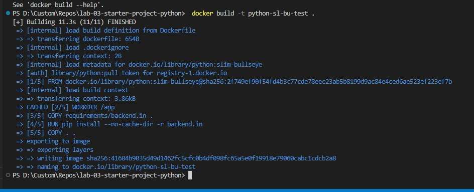
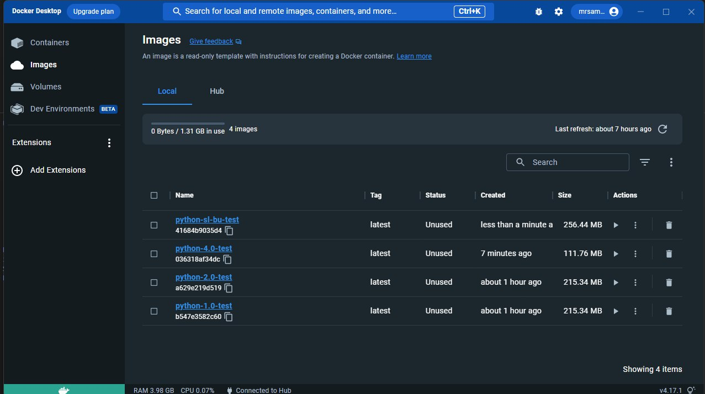
Команда для запуску образу:
```
docker run -p 8080:8080 --rm python-sl.bu-test
```
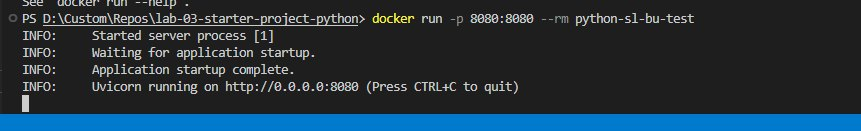
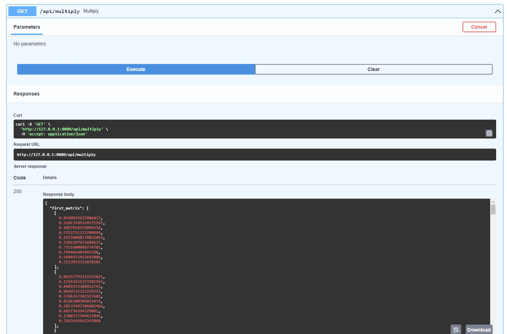
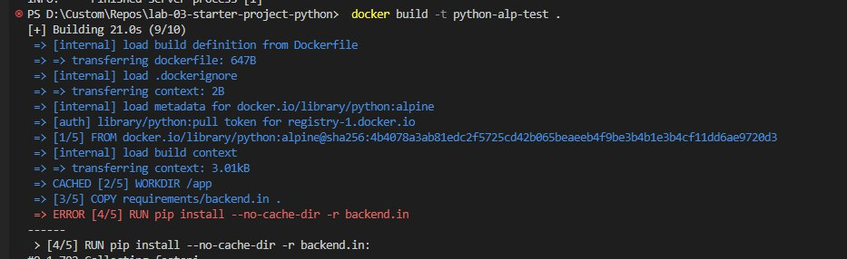
### Збірка образу на базовому образі alpine:
Код докер файлу:

```
#Set the base image to the official Python Alpine image
FROM python:alpine

#Expose port 8080 to the outside world
EXPOSE 8080

#Set the working directory inside the container to /app
WORKDIR /app

#Copy the requirements file into the container
COPY requirements/backend.in .

#Install the required Python packages listed in backend.in
RUN pip install --no-cache-dir -r backend.in

#Copy the entire contents of the current directory into the container
COPY . .

#Specify the command to run when the container starts up
CMD ["uvicorn", "spaceship.main:app", "--host=0.0.0.0", "--port=8080"]
```
[Посилання на коміт](https://github.com/MrSampy/Software-development-methodologies/commit/421f80e3c4dc867c279cc5babc8c6d5ef48a8cf7)</br>

Команда для збірки образу:
```
docker build -t python-alp-test .
```
Під час спроби збору образу, в мене виникла помилка:


Рішення було знайдено [тут](https://stackoverflow.com/questions/73273634/cant-install-wheels-on-docker-for-numpy)

В моєму випадку я просто трішки змінив код докера:

```
#Set the base image to the official Python Alpine image
FROM python:alpine

#Expose port 8080 to the outside world
EXPOSE 8080

#Set the working directory inside the container to /app
WORKDIR /app

#Copy the requirements file into the container
COPY requirements/backend.in .

RUN pip install --extra-index-url https://alpine-wheels.github.io/index numpy

#Install the required Python packages listed in backend.in
RUN pip install --no-cache-dir -r backend.in

#Copy the entire contents of the current directory into the container
COPY . .

#Specify the command to run when the container starts up
CMD ["uvicorn", "spaceship.main:app", "--host=0.0.0.0", "--port=8080"]
```

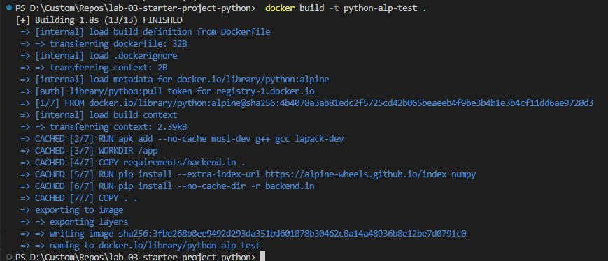

Команда для запуску образу:
```
docker run -p 8080:8080 --rm python-alp-test
```

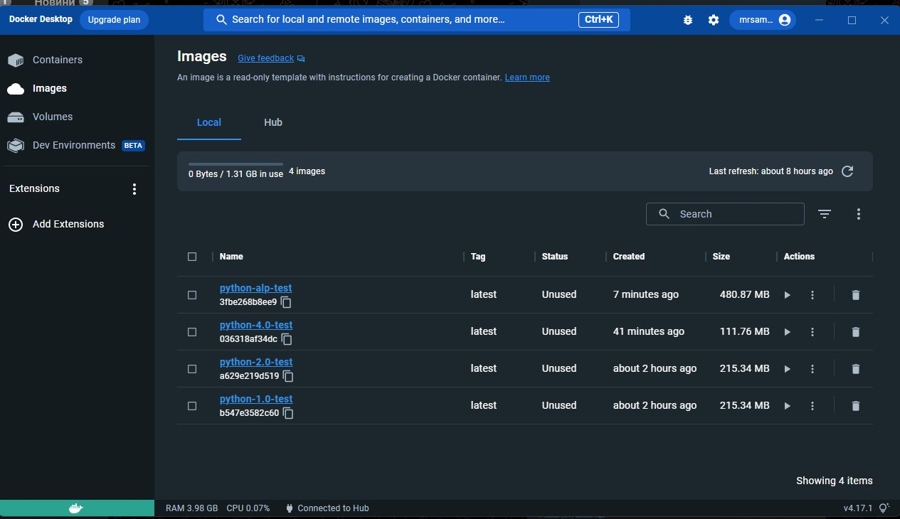

Результат для slim-bullseye :
<b>Розмір: 256.44 М</br>
Час: 11.3 s</b></br>

Результат для alpine:
<b>Розмір: 480.87 М</br>
Час: 1.8 s</b></br>

# Проєкт на мові Go
## Початковий образ в Docker
Код докер файлу:
```
# Use an official Golang runtime as a parent image
FROM golang:latest

# Set the working directory to /app
WORKDIR /app

# Copy the current directory contents into the container at /app
COPY . /app

# Build the Go app and output the binary to /app/build/fizzbuzz
RUN go build -o build/fizzbuzz

# Expose port 8080 for serving the app
EXPOSE 8080

# Run the command to start the app
CMD ["./build/fizzbuzz", "serve"]
```
[Посилання на коміт](https://github.com/MrSampy/Software-development-methodologies/commit/8b666f5ec6455067419aabb4b8c54d95c31c1cf4)</br></br>
Команда для збірки образу:
```
docker build . -t go-v1.0
```
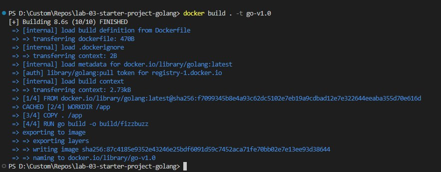
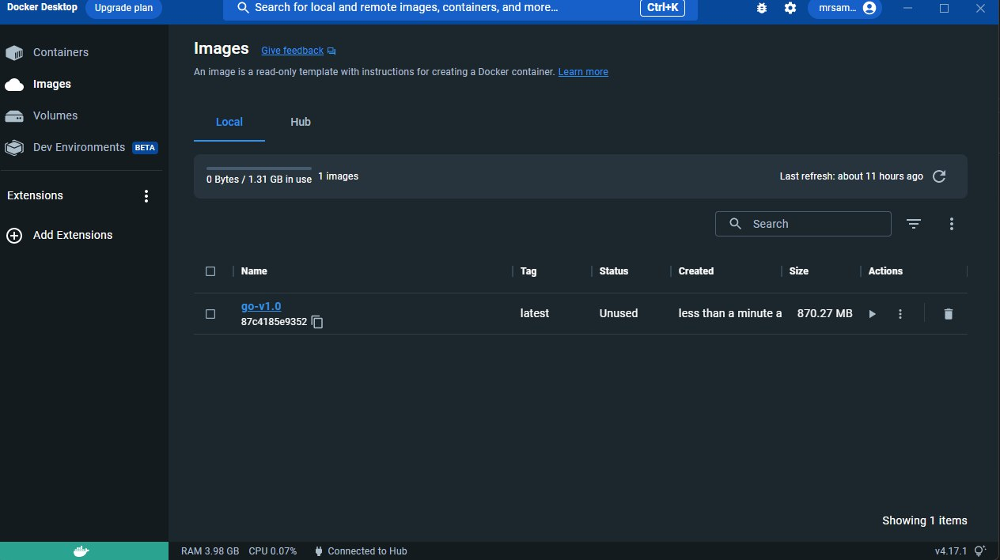
Команда для запуску образу:
```
docker run -p 8080:8080 --rm go-v1.0
```
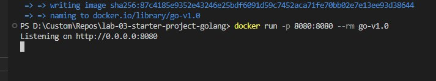


<b>Розмір: 870.27 М </br>
Час: 8.6 s</br>
Чи усі фали, що там є, потрібні для запуску проекту? Фактично, для запуску програмного застосунку потрібний лише бінарний файл.</b>

## Багатоетапна збірка образу за допомогою scratch
Код докер файлу:
```
# Use Golang as a base image and name it "builder" stage
FROM golang AS builder

# Set the working directory to /app
WORKDIR /app

# Copy the go module files to the container and download the dependencies
COPY go.mod go.sum ./
RUN go mod download

# Copy the rest of the application source code to the container and build it
COPY . .
RUN CGO_ENABLED=0 go build -ldflags "-w -s -extldflags '-static'" -o build/fizzbuzz

# Create a new base image from scratch
FROM scratch

# Copy the compiled binary from the "builder" stage to the root directory of the new image
COPY --from=builder /app/build/fizzbuzz /

# Copy the index.html template to the /templates directory in the new image
COPY --from=builder /app/templates/index.html /templates/

# Expose port 8080
EXPOSE 8080

# Start the server by running the compiled binary and serving the application
CMD ["/fizzbuzz", "serve"]
```

Цей <i>Dockerfile</i> використовує мульти-стадійну збірку, де перша стадія (FROM golang AS builder) збирає проект та створює статично зв'язаний бінарний файл, тоді як друга стадія (FROM scratch) створює кінцевий образ, що містить лише бінарний файл та необхідні файли.

Інструкція <i>WORKDIR</i> встановлює робочу директорію на /app, а <i>COPY</i> копіює вміст поточної директорії в контейнер за шляхом /app.

Інструкція <i>RUN</i> збирає проект з вимкненим <i>CGO</i> та створює статично зв'язаний бінарний файл. Прапорці -w та -s використовуються для зменшення розміру бінарного файлу за рахунок відсутності відлагоджувальної інформації та таблиці символів, а прапорець `-extldflags '-static' вказує, що бінарний файл має бути статично зв'язаний.

У другій стадії, інструкція <i>FROM</i> scratch вказує на базовий образ, який не містить ОС або бібліотек, тому що ми використовуємо лише статично зв'язаний бінарний файл.

Інструкції <i>COPY</i> копіюють бінарний файл та HTML-шаблон з образу збірника до кінцевого образу за відповідними шляхами.

Інструкція <i>EXPOSE</i> відкриває порт 8080, на якому буде працювати сервер.

Інструкція <i>CMD</i> запускає команду /fizzbuzz serve при запуску контейнера, тобто запускає сервер. Команда /fizzbuzz вказує на бінарний файл, який було скомпільовано в першій стадії.

[Посилання на коміт](https://github.com/MrSampy/Software-development-methodologies/commit/1b595f153836ca6a5c82987d80a23ca84ab5749d)</br></br>
Команда для збірки образу:
```
docker build . -t go-scratch
```
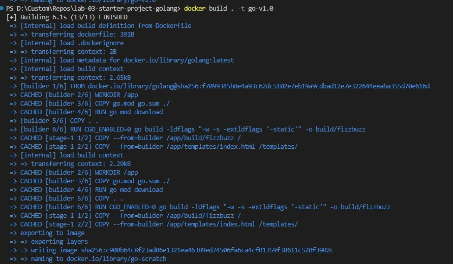
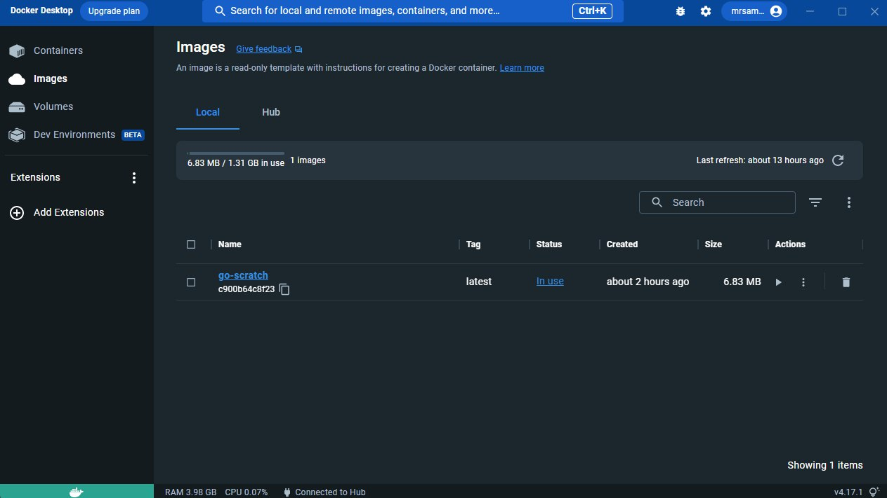
Команда для запуску образу:
```
docker run -p 8080:8080 --rm go-scratch
```
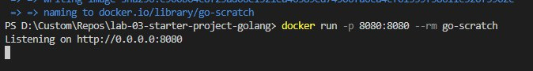
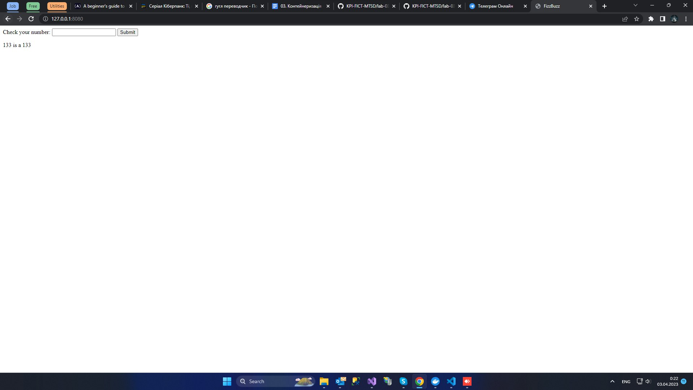

<b>Розмір: 6.83 М(Розмір зменшився через використання пустого образу та бінарного файлу) </br>
Час: 6.1 s(Час зменшився, бо деякі процесибули взяті з кешу)</br>
Чи достатньо файлів для запуску нашого проекту? Якщо виконуваний файл скомпільовано статично (що означає, що всі залежності включені в нього), то також необхідно скопіювати HTML-сторінку.</br>
Чи зручно таким образом користуватися? Я вважаю, що використання образу "scratch" може бути корисним у деяких випадках, коли необхідно створити дуже легкий Docker-образ. Однак, використання цього образу може бути незручним для більшості застосувань, оскільки потрібно вручну додавати всі необхідні файли та залежності до контейнера. Це може зайняти багато часу та зусиль, особливо для складних додатків з багатьма залежностями. Тому варто розглядати використання образу "scratch" тільки в тому випадку, якщо потрібен дуже легкий образ, і ви готові вручну додати всі необхідні файли та залежності до контейнера. В інших випадках кращим варіантом може бути використання інших образів, що вже містять необхідні залежності.
</b>

## Багатоетапна збірка образу за допомогою distorless
Код докер файлу:
```
# Use the official Golang image as a builder stage
FROM golang AS builder

# Set the working directory inside the container to /app
WORKDIR /app

# Copy the go.mod and go.sum files into the container
COPY go.mod go.sum ./

# Download the Go module dependencies
RUN go mod download

# Copy the rest of the application source code into the container
COPY . .

# Build the application and create a binary called fizzbuzz in the /app/build directory
RUN go build -o build/fizzbuzz

# Use the distroless/base image as the final image
FROM gcr.io/distroless/base

# Copy the fizzbuzz binary from the builder stage into the final image
COPY --from=builder /app/build/fizzbuzz /

# Copy the index.html template file from the builder stage into the final image
COPY --from=builder /app/templates/index.html /templates/

# Expose port 8080 so that it can be accessed from outside the container
EXPOSE 8080

# Start the application by running the /fizzbuzz command with the serve argument
CMD ["/fizzbuzz", "serve"]
```
[Посилання на коміт](https://github.com/MrSampy/Software-development-methodologies/commit/f23abbb2e944df45f303f664978df341a6c5f748)</br></br>
Команда для збірки образу:
```
docker build . -t go-distorless
```
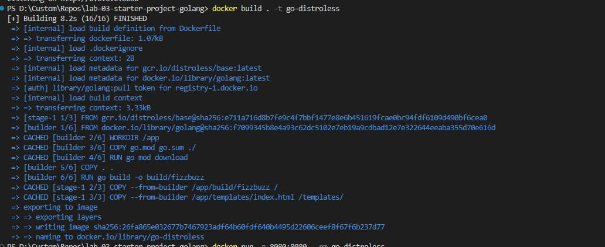
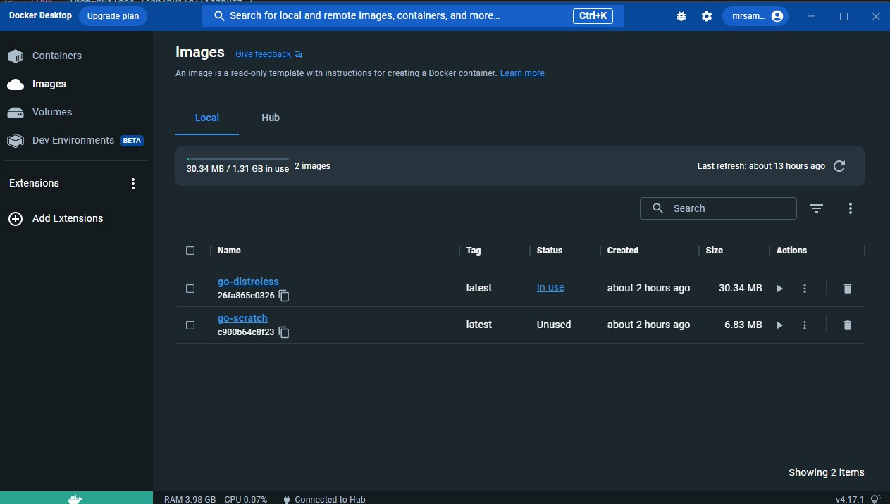
Команда для запуску образу:
```
docker run -p 8080:8080 --rm go-distorless
```
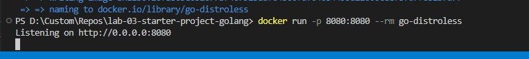
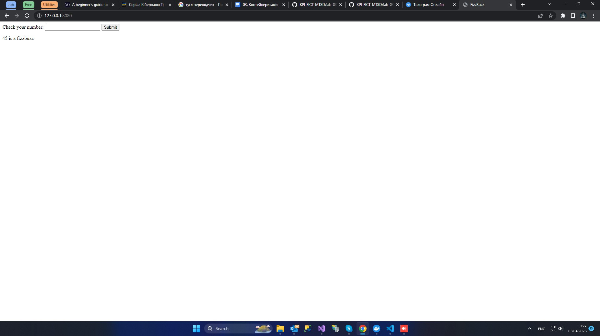

<b>Розмір: 870.27 М </br>
Час: 30.34 s</b></br>

Scratch та Distroless - це дві різні базові Docker-імеджі, які мають свої особливості та використовуються для різних цілей.

Scratch - це найлегший можливий Docker-імедж, який важить всього декілька кілобайт. Він не містить жодних пакетів або залежностей, тому що він створений з метою забезпечення максимальної ефективності та безпеки. Scratch використовують для створення дуже малих та ефективних імеджів, але його використання потребує багато знань про конфігурацію та налаштування середовища.

Distroless - це імедж, який містить лише те, що необхідно для запуску конкретного додатку, наприклад, веб-сервера. Цей імедж забезпечує безпеку та ефективність, так само як і Scratch, але він має більш простий інтерфейс, що дозволяє швидко та легко використовувати його для запуску додатків. Distroless може містити базовий набір пакетів, що необхідні для запуску додатку, таких як OpenSSL, але загалом він містить лише мінімальний набір пакетів.

Отже, Scratch та Distroless мають схожу функціональність, але відрізняються своїм розміром та складністю використання. Scratch - це найлегший можливий імедж, який потребує додаткових знань для коректної конфігурації, тоді як Distroless - це більш повний імедж, який можна використовувати з мінімальними знаннями.

# Проєкт на мові C#
## Початковий Docker файл

Код докер файлу:
```
FROM mcr.microsoft.com/dotnet/sdk:6.0 
 
WORKDIR /app 
 
EXPOSE 8888 
 
COPY . . 
 
RUN dotnet restore 
 
RUN dotnet build -c Release 
 
CMD ["dotnet", "run"]
```
[Посилання на коміт](https://github.com/MrSampy/Software-development-methodologies/commit/e1606e32c6ef3d147d7994c9b8b8ff7a5762b98d)</br></br>
Команда для збірки образу:
```
docker build -t sharp-proj:1.0 .
```
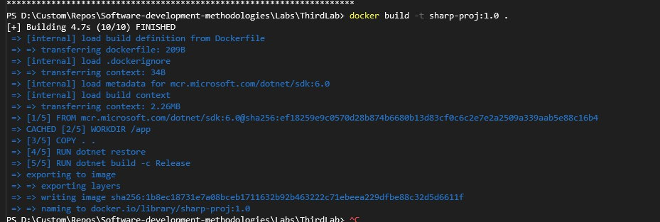

Команда для запуску образу:
```
docker run -it --rm -p 8888:8888 sharp-proj:1.0
```
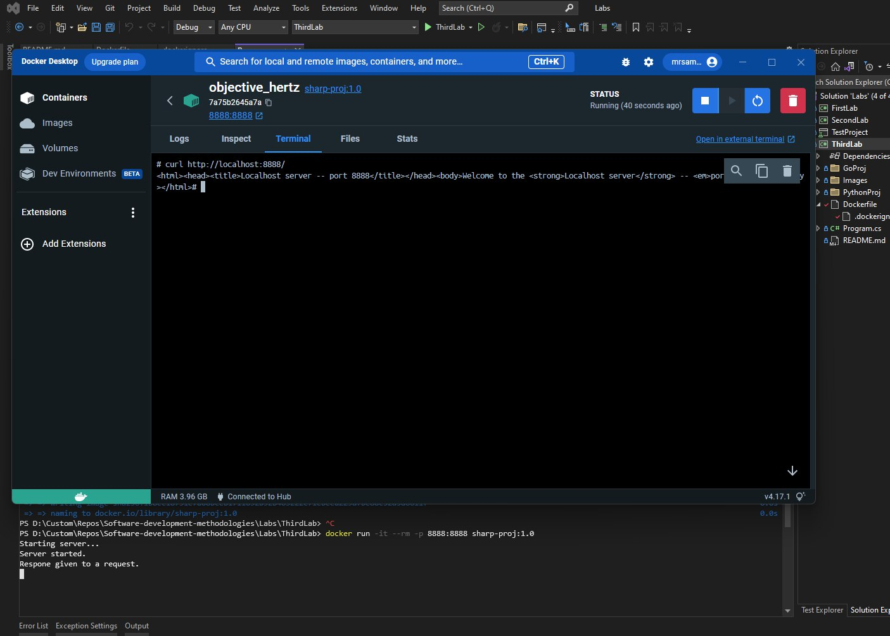
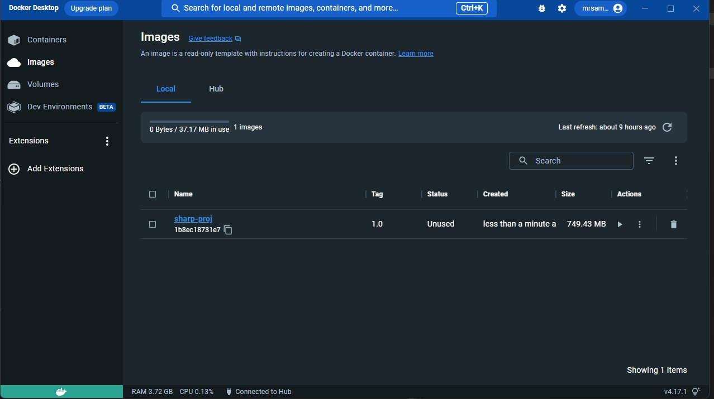

Скопійовані файли
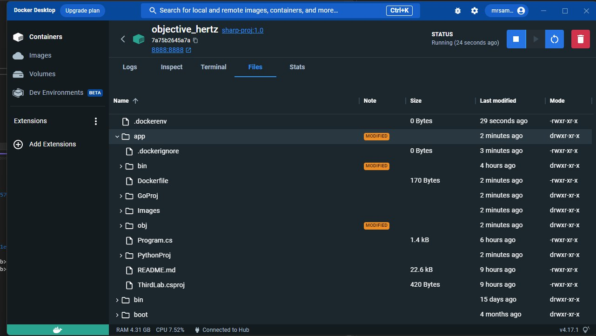


<b>Розмір: 749.43 М </br>
Час: 4.7 s</b></br>

## Додавання .dockerignore
Як можна побачити в минулому, програма копіює непотрібні папки та файли, тож це вирішується додавання файлу .dockerignore

Код .dockerignore файлу:
```
README.md 
/PythonProj 
/GoProj 
/Images
```

[Посилання на коміт](https://github.com/MrSampy/Software-development-methodologies/commit/59a6f7d95a4ae2ffd3d0f514c9708c55dc58f6e5)</br></br>
Команда для збірки образу:
```
docker build -t sharp-proj:2.0 .
```
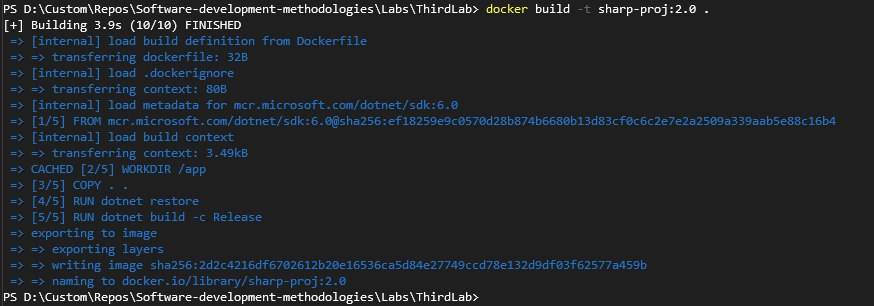

Команда для запуску образу:
```
docker run -it --rm -p 8888:8888 sharp-proj:2.0
```
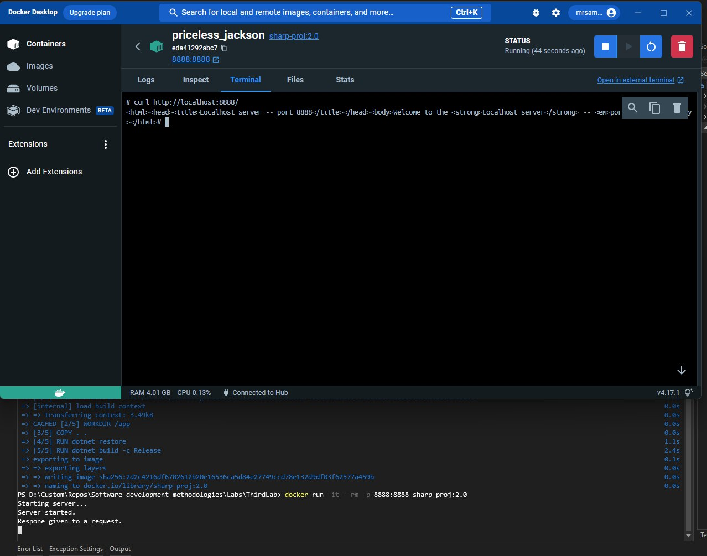
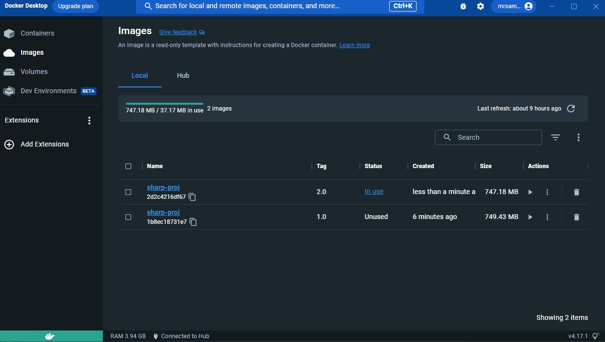

Скопійовані файли
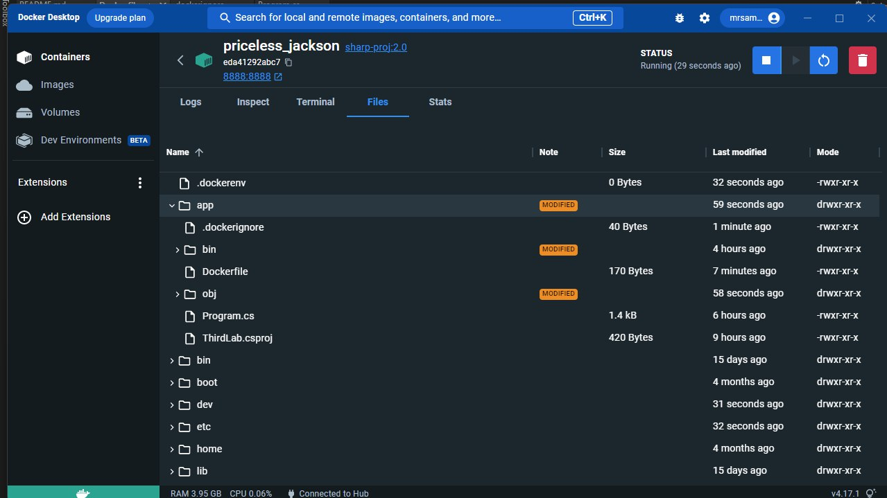


<b>Розмір: 747.18 М(Трішки зменшвися розмір тому, що програмі тепер треба менше копіювати) </br>
Час: 3.9 s(Час також зменшився, бо нам треба менше копіювати)</b></br>

## Оптимізація докефайлу
Мені не дуже сподобалось, що розмір образу такий великий, тому я вирішив оптимізувати докерфайл за допомогою вже вивчених способів: alpine та багатоетапної збірки

Код докер файлу:
```
# Build stage 
FROM mcr.microsoft.com/dotnet/sdk:6.0-alpine AS build 
 
WORKDIR /app 
 
COPY . . 
 
RUN dotnet restore 
 
RUN dotnet publish -c Release -o out 
 
# Runtime stage 
FROM mcr.microsoft.com/dotnet/runtime:6.0-alpine AS runtime 
 
WORKDIR /app 
 
COPY --from=build /app/out . 
 
RUN apk add curl 
 
CMD ["dotnet", "ThirdLab.dll"]
```

[Посилання на коміт](https://github.com/MrSampy/Software-development-methodologies/commit/b82a9cb09f1a856cb8407c736a584e6fd0c50be1)</br></br>
Команда для збірки образу:
```
docker build -t sharp-proj:3.0 .
```
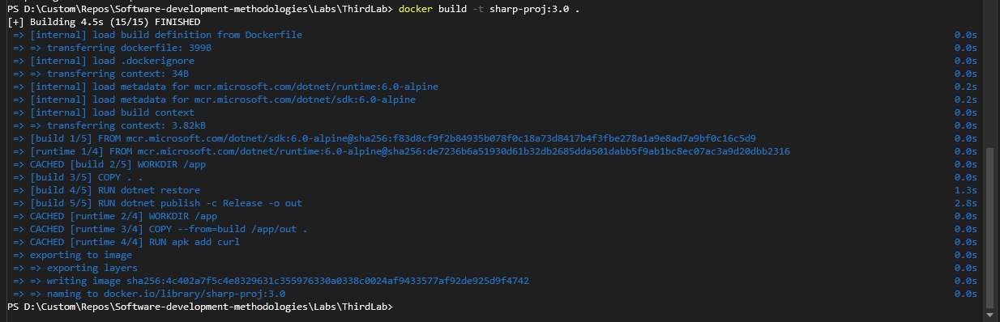

Команда для запуску образу:
```
docker run -it --rm -p 8888:8888 sharp-proj:3.0
```
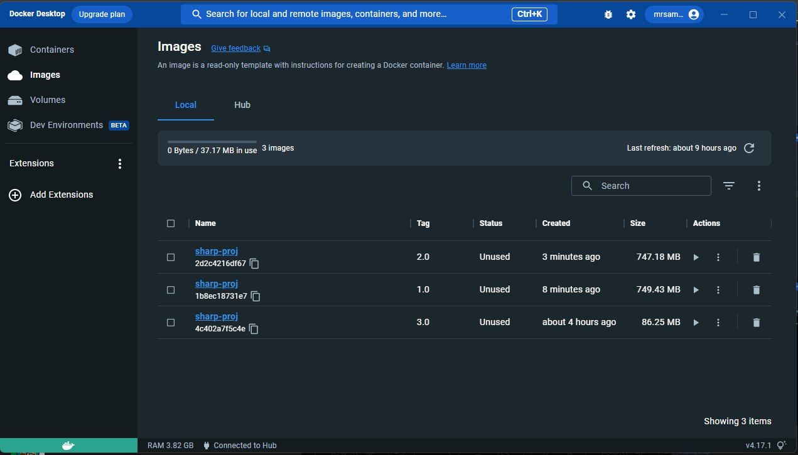
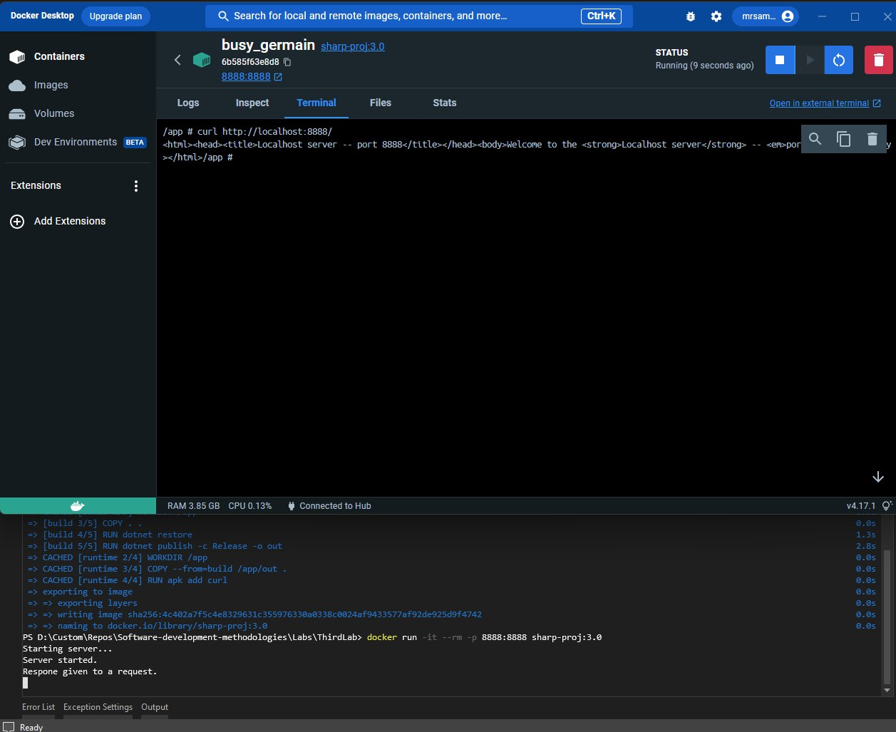

<b>Розмір: 86.25 М(Розмір зменшився тому, що ми оптимізували код докеру) </br>
Час: 4.5 s(Час збільшився, бо треба робити більше операцій)</b></br>